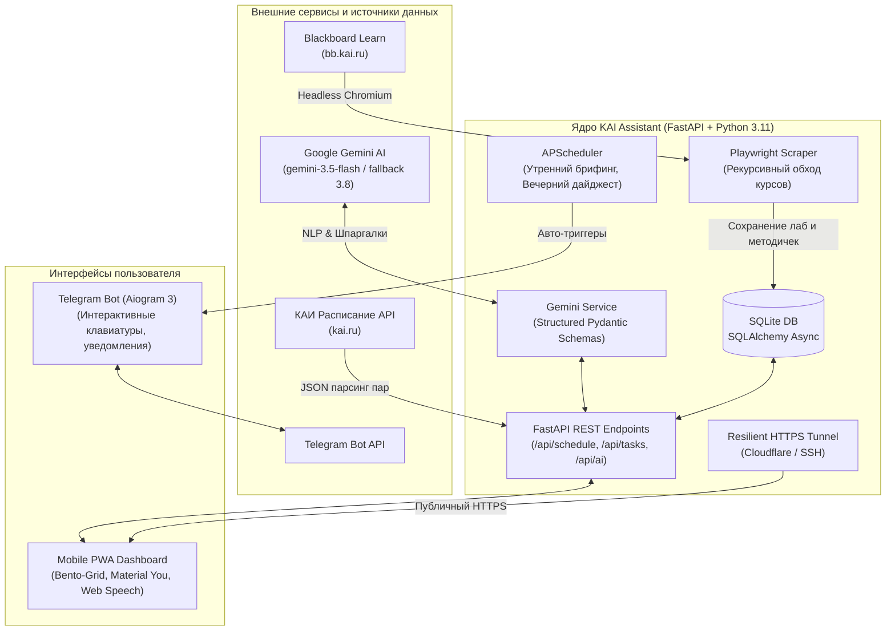
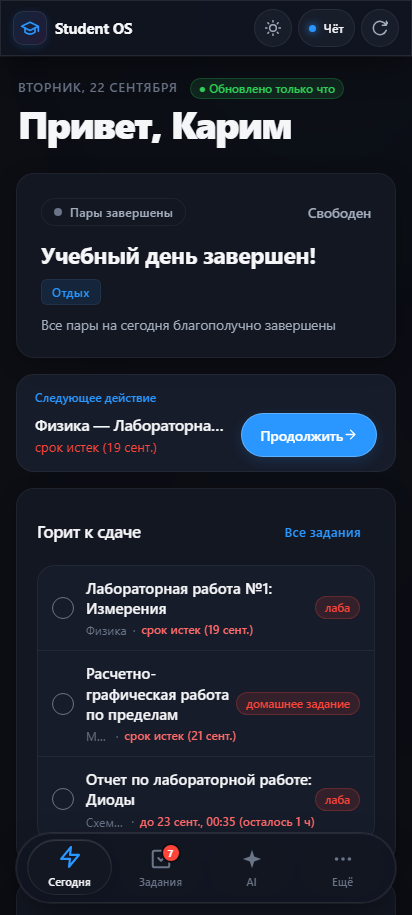
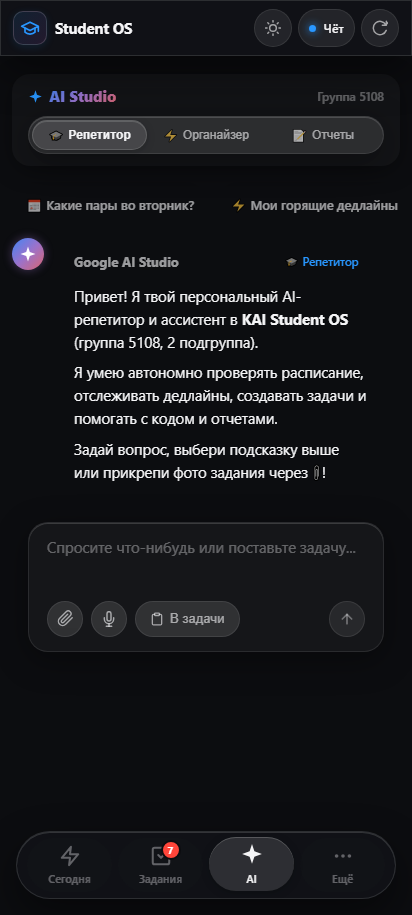
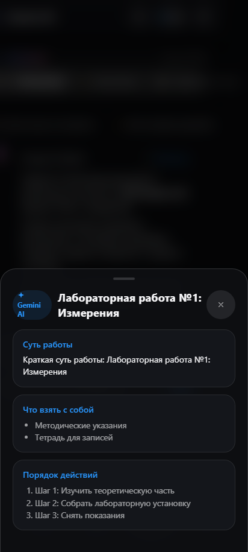
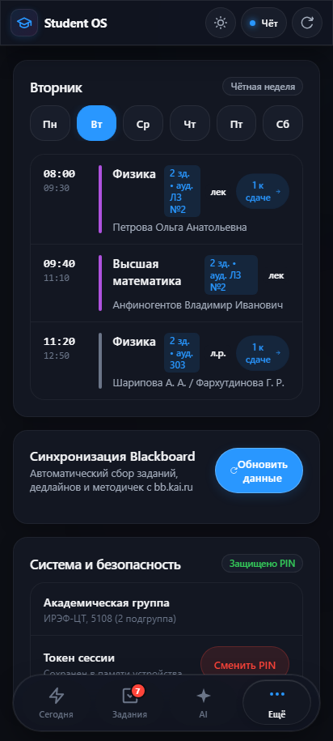
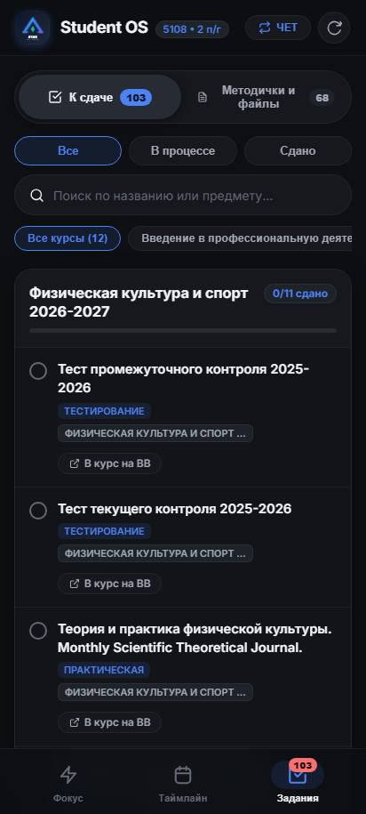
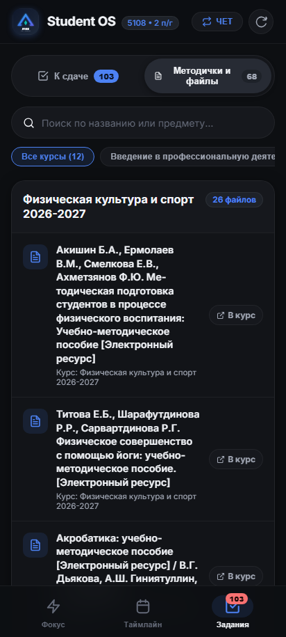

# 🚀 KAI Student OS 2.0 (ИТИО / ИРЭФ-ЦТ, гр. 5108)

<div align="center">

[](https://www.python.org/)
[](https://fastapi.tiangolo.com/)
[](https://docs.aiogram.dev/)
[](https://ai.google.dev/)
[](https://playwright.dev/)
[](https://www.sqlalchemy.org/)
[](https://web.dev/progressive-web-apps/)
[](https://nginx.org/)
[](https://letsencrypt.org/)

**Персональная экосистема студента КНИТУ-КАИ им. А.Н. Туполева:**  
*Умное расписание, автономный трекер долгов, 3-уровневый краулер Blackboard Learn, нейросетевой разбор лабораторных на базе Google Gemini и проактивный Telegram-бот.*

[📱 Возможности](#-ключевые-возможности) • [🏛 Архитектура](#-архитектура-системы) • [📸 Скриншоты интерфейса](#-интерфейс-student-os-20) • [⚡ Быстрый старт](#-быстрый-старт-локально) • [🌐 Деплой на Linux](#-деплой-в-продакшн-linux--systemd--nginx)

</div>

---

## 🎯 О проекте

**KAI Student OS 2.0** решает ключевую проблему студента технического вуза — информационный хаос между разрозненными порталами:
1. Расписание пар обновляется на официальном сайте `kai.ru` (со сложным делением на числитель/знаменатель и подгруппы).
2. Задания, методички и файлы лежат в закрытом портале **Blackboard Learn** (`bb.kai.ru`), требующем авторизации и глубокого обхода дерева курсов.
3. Важные требования и дедлайны старосты пересылают в чаты Telegram свободной речью.

Система объединяет все потоки в единую автономную систему с удобным **мобильным веб-приложением (PWA)**, **Telegram-ботом с проактивными напоминаниями** и **ИИ-ассистентом Google Gemini**.

---

## ✨ Ключевые возможности

### 1. ⚡ Bento-Grid Dashboard (Nothing OS / Linear Style)
- **Live-индикатор текущей пары**: в реальном времени определяет текущую пару или перемену, отображает прогресс-бар оставшегося времени, здание и аудиторию.
- **Учет расписания звонков КАИ**: автоматический расчет таймингов (1 пара: 08:00–09:30, 2 пара: 09:40–11:10 и т.д.).
- **Интерактивные кольца прогресса (Progress Rings)**: наглядный процент сданных лабораторных работ семестра с разбивкой по долгам и закрытым работам.
- **PWA-автономность и изоляция данных**: полноценная установка на Android / iOS как PWA; Service Worker (`sw.js`) кэширует статические ресурсы интерфейса для мгновенного запуска offline, а персональные задачи, расписание и история диалогов AI (`kai_ai_history:{user_id}`) строго изолированы для каждой учетной записи.

### 2. 📅 Интеллектуальный парсер расписания КАИ
- Живой опрос публичного REST API `kai.ru/raspisanie`.
- **Изоляция 2-й подгруппы**: автоматическое отсечение занятий 1-й подгруппы (`1 п/г`, `1 подгр.`), корректное объединение общепоточных лекций и индивидуальных лабораторных.
- **Динамический расчет четности недели**: автоопределение четности по ISO-календарю с возможностью мгновенного переключения (ЧЁТ / НЕЧЁТ) прямо в интерфейсе.
- Быстрая привязка: клик по кнопке `⚡ К этой паре: N заданий` в расписании мгновенно переносит в список несданных работ по этому предмету.

### 3. 🕷️ 3-уровневый рекурсивный краулер Blackboard Learn (687 учебных материалов)
- Автоматизированный headless-сбор данных через **Playwright** с сохранением сессионных cookie (`storage_state.json`).
- **Глубокий рекурсивный обход DOM-дерева**: раскрывает папки, подразделы учебных материалов и вложенные контейнеры курсов.
- **Строгая изоляция файлов**: каждый материал и лабораторная связываются исключительно со своим оригинальным файлом без утечки ссылок.
- **Защищенное скачивание через бэкенд (`/api/tasks/{task_id}/download`)**: авторизация исключительно через заголовок `Authorization: Bearer <token>`, `X-App-Token` или сессионную cookie (`kai_app_auth_token`). Токены в URL (`?token=`) строго запрещены (401) для предотвращения утечки в access-логи; проверка прав владения задачей (403), сандбоксинг хранилища вложений (`data/attachments`) и надежная защита от Path Traversal (`../`, `..\`, `%2e%2e`).
- **Smart Split**: автоматическое разделение контента на **«Сдачу работ»** (лабораторные, практики, расчеты) и **«Библиотеку методичек»** (программы дисциплин, ФОС, лекции, вопросы к зачету).

### 4. 🤖 Капи AI на базе Gemini 3.5 Flash & Action Confirmation
- **Интеллектуальный ассистент студента (Капи AI · группа 5108)**:
  - 🎓 **Академический тьютор**: глубокое объяснение сложных тем, физико-математических формул и теории с форматированием Markdown, KaTeX и подсветкой синтаксиса кода.
  - ⚡ **Органайзер и Function Calling**: автономный сбор контекста — чтение расписания на день/неделю (`get_schedule`), анализ горящих дедлайнов (`get_pending_tasks`), подготовка задач.
  - 📝 **Генератор шпаргалок к лабораторным**: емкая выжимка сути работы, требований, списка «что взять с собой» и пошагового алгоритма.
  - 👁️ **Vision & Multimodal**: анализ фото конспектов, методичек и рукописных задач с доски.
- **Двухфазное подтверждение действий (Safety Action Previews)**:
  - Никакой скрытой записи в БД: все мутирующие операции (создание, закрытие, редактирование, удаление задачи, перенос дедлайна) возвращают карточку предпросмотра (`requires_confirmation: True`). Запись в БД происходит только после явного нажатия кнопки «Подтвердить». Read-only запросы выполняются моментально.
- **Минималистичная плавающая капсула (Floating Capsule Composer)**:
  - Компактный эргономичный док Nothing OS с кнопкой вложений фото, голосовым вводом Web Speech API 🎙️ и быстрым формированием задач.
- **Multi-Model Fallback & Честная производительность**:
  - Основная модель — `gemini-3.5-flash` с динамическим fallback на `gemini-3.8-flash`.
  - Реальная задержка генерации ответа модели с включенным low thinking budget составляет 3–8 секунд; повторные запросы шпаргалок к лабораторным отдаются моментально (<50 мс) благодаря серверному кэшу `DeterministicAiCache`.
- **✨ Разбор лабораторной (Cheat-Sheet)**:
  - Структурированный разбор: **Суть работы** (в 2 предложениях), **Что взять с собой** (титульник, отчет, флешка, калькулятор) и **Порядок действий** (пошаговый алгоритм выполнения).
  - Детерминированное кэширование на сервере (`DeterministicAiCache`) для моментального повторного открытия.

### 5. 📬 Proactive Alert System (Telegram-бот на Aiogram 3)
- **Утренний брифинг (07:30)**: маршрутный лист на день с номерами корпусов, аудиторий, преподавателями и списком того, что нужно взять с собой.
- **Вечерний дайджест дедлайнов (20:00)**: напоминание о горящих дедлайнах на завтра и ближайшие дни.
- **Фоновая синхронизация (каждые 4 часа)**: автоматический тихий опрос Blackboard на появление новых лабораторных.
- **Интерактивные инлайн-кнопки**: отметка о сдаче работы прямо из Telegram с синхронизацией в веб-интерфейс и возможностью отмены случайного клика.

---

## 🏛 Архитектура системы



---

## 📸 Интерфейс Student OS 2.0

<div align="center">

| Bento-Grid Главная (Hero & Live Пара) | Google AI Studio (Чат & Floating Capsule) | Шпаргалка к лабораторной работе |
|:---:|:---:|:---:|
|  |  |  |

| Таймлайн расписания с корпусами | Управление сдаваемыми работами | Библиотека методичек с прямым скачиванием |
|:---:|:---:|:---:|
|  |  |  |

</div>

---

## 📂 Структура репозитория

```text
kai_assistant/
├── api/
│   └── app.py                 # FastAPI REST API, PWA статика, эндпоинты расписания, задач и AI
├── bot/
│   └── handlers/
│       ├── base.py            # Команды /start, /help, главное меню бота
│       ├── schedule.py        # Просмотр расписания на сегодня/завтра/неделю
│       └── tasks.py           # Интерактивное управление долгами и сданными работами
├── core/
│   └── config.py              # Pydantic Settings: конфигурация и переменные окружения
├── database/
│   ├── connection.py          # Асинхронный движок SQLAlchemy + aiosqlite
│   ├── models.py              # Модели Subject, Task, Attachment
│   └── crud.py                # CRUD операции с оптимизированными выборками
├── scheduler/
│   └── jobs.py                # Фоновый планировщик уведомлений APScheduler
├── services/
│   ├── kai_api.py             # Клиент API расписания КАИ (фильтрация подгрупп, четность)
│   ├── bb_scraper.py          # Рекурсивный краулер Blackboard Learn на Playwright
│   ├── gemini_service.py      # Интеграция Google Gemini AI (NLP парсинг и шпаргалки)
│   └── tunnel.py              # Менеджер безопасных HTTPS-туннелей (Cloudflare / SSH)
├── static/                    # Мобильный PWA клиент
│   ├── index.html             # Разметка Bento-Dashboard, Google AI Studio, модалок и PWA
│   ├── styles.css             # Дизайн-система Google Material You / Dark Theme
│   ├── app.js                 # Клиентская логика, Web Speech API, офлайн-кэш
│   ├── sw.js                  # Service Worker PWA (Network-first стратегия)
│   └── manifest.json          # Манифест PWA приложения для Android / iOS
├── docs/                      # Документация и скриншоты для портфолио
├── run.py                     # Единая точка входа: сервер FastAPI + Telegram бот + Туннель
├── requirements.txt           # Зависимости проекта
├── .env.example               # Эталонный шаблон конфигурации
└── README.md                  # Документация проекта
```

---

## ⚡ Быстрый старт (локально)

### 1. Клонирование репозитория
```bash
git clone https://github.com/your-username/kai-student-os.git
cd kai-student-os
```

### 2. Создание виртуального окружения
```bash
# Linux / macOS
python3 -m venv .venv
source .venv/bin/activate

# Windows (PowerShell)
python -m venv .venv
.venv\Scripts\Activate.ps1
```

### 3. Установка зависимостей и браузеров Playwright
```bash
pip install --upgrade pip
pip install -r requirements.txt
playwright install chromium
```

### 4. Настройка конфигурации
Скопируйте файл `.env.example` в `.env` и укажите ваши параметры:
```bash
cp .env.example .env
```
Минимально необходимые переменные:
- `BOT_TOKEN`: токен Telegram-бота от [@BotFather](https://t.me/BotFather).
- `TG_USER_ID`: ваш ID в Telegram для получения уведомлений (узнать у [@userinfobot](https://t.me/userinfobot)).
- `BB_LOGIN` и `BB_PASSWORD`: логин и пароль от Blackboard КАИ.
- `GEMINI_API_KEY`: бесплатный ключ из [Google AI Studio](https://aistudio.google.com/).

### 5. Запуск
```bash
python run.py
```
После старта приложение:
- Инициализирует базу данных SQLite (`kai_assistant.db`).
- Поднимет веб-сервер на `http://localhost:8000`.
- Запустит фонового Telegram-бота и планировщик.
- Сгенерирует публичный HTTPS-адрес для смартфона и отправит его вам в Telegram!

---

## 🌐 Деплой в продакшн (Linux + systemd + Nginx)

Для круглосуточной автономной работы на VPS (Ubuntu 22.04 / 24.04 LTS):

### 1. Установка системных пакетов
```bash
sudo apt update && sudo apt install -y python3-venv python3-pip nginx certbot python3-certbot-nginx
```

### 2. Развертывание проекта
```bash
sudo mkdir -p /opt/kai-assistant
sudo chown -R $USER:$USER /opt/kai-assistant
git clone https://github.com/your-username/kai-student-os.git /opt/kai-assistant
cd /opt/kai-assistant

python3 -m venv .venv
source .venv/bin/activate
pip install -r requirements.txt
playwright install --with-deps chromium

cp .env.example .env
nano .env  # Укажите ваши боевые секреты (ENABLE_TUNNEL=False при наличии своего домена)
```

### 3. Настройка службы systemd
Создайте юнит `/etc/systemd/system/kai-assistant.service`:
```ini
[Unit]
Description=KAI Student OS 2.0 Daemon
After=network.target

[Service]
Type=simple
User=ubuntu
WorkingDirectory=/opt/kai-assistant
ExecStart=/opt/kai-assistant/.venv/bin/python run.py
Restart=always
RestartSec=5
Environment=PYTHONUNBUFFERED=1

[Install]
WantedBy=multi-user.target
```
Активируйте и запустите службу:
```bash
sudo systemctl daemon-reload
sudo systemctl enable --now kai-assistant.service
sudo systemctl status kai-assistant.service
```

### 4. Настройка Nginx с SSL (HTTPS)
Создайте конфигурацию виртуального хоста `/etc/nginx/sites-available/kai-assistant`:
```nginx
server {
    server_name kai.yourdomain.com;

    location / {
        proxy_pass http://127.0.0.1:8000;
        proxy_http_version 1.1;
        proxy_set_header Upgrade $http_upgrade;
        proxy_set_header Connection "upgrade";
        proxy_set_header Host $host;
        proxy_set_header X-Real-IP $remote_addr;
        proxy_set_header X-Forwarded-For $proxy_add_x_forwarded_for;
        proxy_set_header X-Forwarded-Proto $scheme;
    }
}
```
Подключите сайт и выпустите бесплатный SSL-сертификат Let's Encrypt:
```bash
sudo ln -s /etc/nginx/sites-available/kai-assistant /etc/nginx/sites-enabled/
sudo nginx -t && sudo systemctl reload nginx
sudo certbot --nginx -d kai.yourdomain.com
```

Теперь приложение доступно по вашему личному защищенному адресу `https://kai.yourdomain.com` 24/7!

---

## 🛠 Технологический стек

| Направление | Технологии |
|---|---|
| **Backend Framework** | [FastAPI](https://fastapi.tiangolo.com/), [Uvicorn](https://www.uvicorn.org/), ASGI |
| **Telegram Bot** | [Aiogram 3.x](https://docs.aiogram.dev/), Telegram Bot API, Async Event Driven |
| **Artificial Intelligence** | [Google GenAI SDK](https://ai.google.dev/), Gemini 3.5 Flash (Fallback: Gemini 3.8 Flash), Agentic Tools & Structured Prompts |
| **Web Scraping** | [Playwright Chromium](https://playwright.dev/python/), BeautifulSoup4, aiohttp |
| **Database & ORM** | [SQLAlchemy 2.0](https://www.sqlalchemy.org/) (Async Engine), [aiosqlite](https://github.com/omnilib/aiosqlite), SQLite |
| **Scheduler** | [APScheduler 3.x](https://apscheduler.readthedocs.io/) (AsyncIOScheduler) |
| **Frontend & PWA** | Vanilla ES6+ JavaScript, CSS3 Variables, Google Material You, Web Speech API, Service Workers |
| **DevOps & Tunnels** | Systemd, Nginx Reverse Proxy, Let's Encrypt, Cloudflare Tunnels, SSH Reverse Port Forwarding |

---

## 📄 Лицензия

Проект распространяется под открытой лицензией [MIT](LICENSE).  
Разработано для студентов группы 5108 (ИТИО / ИРЭФ-ЦТ КНИТУ-КАИ).
